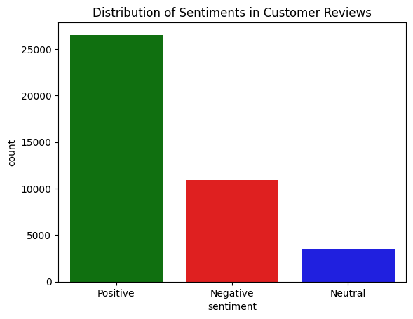
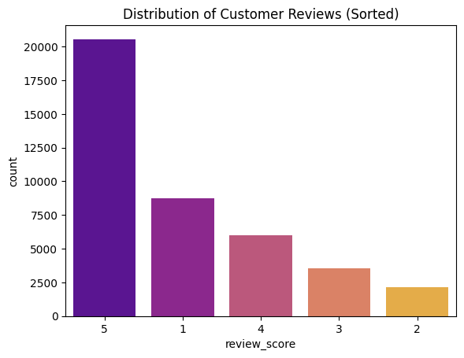
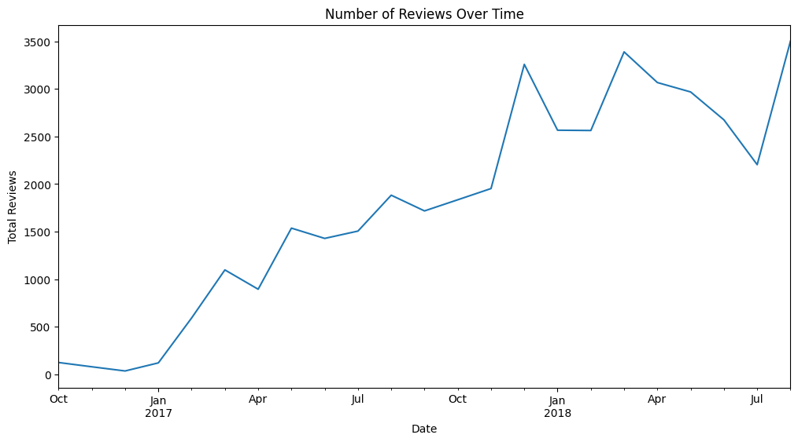
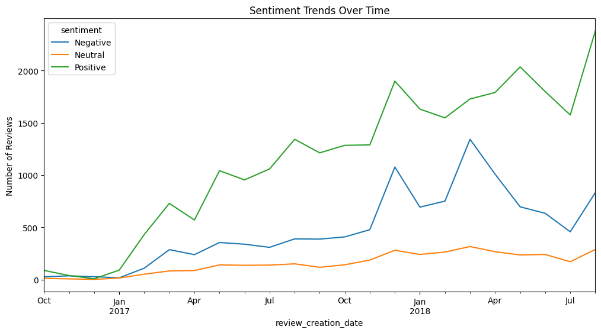
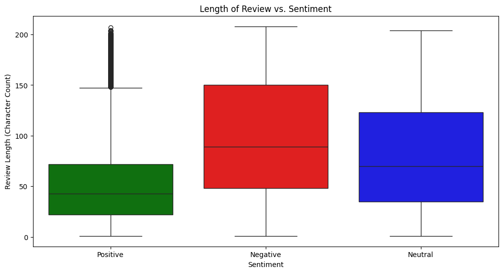
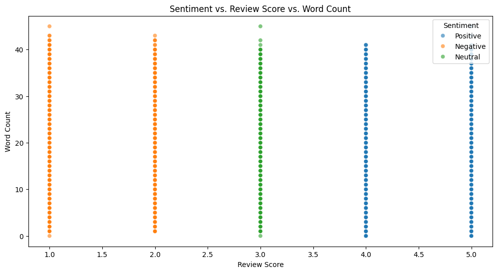

# Trafilea-SentiTrack-Analyzing-Customer-Pain-Points-Through-Review-Mining
A data-driven approach to analyzing customer reviews and support interactions to identify pain points for improving the e-commerce experience.

## 1. Introduction
This project leverages Natural Language Processing (NLP) and machine learning techniques to analyze customer reviews and support interactions for Trafilea's tech commerce platform. The analysis focuses on identifying customer sentiment patterns and extracting specific pain points from negative reviews, providing actionable insights to improve customer experience and business outcomes.

## 2. Background
In the competitive tech commerce space, understanding customer sentiment across touchpoints is crucial for improving satisfaction and retention. Trafilea needs systematic analysis of qualitative feedback to identify improvement opportunities and competitive advantages. This project addresses the critical challenge of processing and interpreting large volumes of customer feedback by implementing multiple sentiment analysis pipelines and identifying the most effective approach for Trafilea's specific needs.

## 3. Data Collection and Processing
### Data Sources
- Order reviews dataset containing 40,977 customer reviews
- Reviews include scores (1-5 star rating) and text comments
- Each review is associated with timestamps for creation and response

### Preprocessing Steps
- Conversion of timestamps to datetime format
- Mapping of review scores to sentiment labels:
  - Scores 4-5: Positive
  - Score 3: Neutral
  - Scores 1-2: Negative
- Translation of reviews from Portuguese to English using T5 transformer model
- Text cleaning and preprocessing:
  - Tokenization using NLTK
  - Stop words removal while preserving context
  - Creation of both Bag of Words (BoW) and TF-IDF representations

## 4. Exploratory Data Analysis (EDA)
### Sentiment Distribution

The analysis reveals a significant imbalance in sentiment distribution:
- Positive reviews: 26,530 (64.7%)
- Negative reviews: 10,890 (26.6%)
- Neutral reviews: 3,557 (8.7%)

### Review Score Distribution

Review scores show polarization with many 5-star and 1-star ratings, suggesting strong customer opinions (either very satisfied or very dissatisfied).

### Review Volume Trends

The number of reviews increased over time, indicating growing customer engagement or expanding business operations.

### Sentiment Trends Over Time

While positive sentiment dominates across all periods, there's a noticeable increasing trend in negative sentiment that warrants further investigation.

### Review Length Analysis

Negative reviews tend to be significantly longer than positive ones, suggesting customers provide more detailed feedback when dissatisfied.

### Word Count Analysis

The scatter plot confirms the relationship between sentiment, review score, and review length, with negative reviews generally containing more words.

## 5. Methodology
### Pipeline Implementations
We implemented four different sentiment analysis pipelines to determine the most effective approach:

1. **Text → VADER**: Direct application of VADER sentiment analyzer on translated reviews
2. **Text → Stopwords Removal → VADER**: Application of VADER after removing stopwords
3. **Text → Stopwords Removal → Bag of Words → Custom Model**: Machine learning approach using BoW features
4. **Text → Stopwords Removal → TF-IDF → Custom Model**: Machine learning approach using TF-IDF features

### Model Training and Evaluation
- Dataset split: 80% training (32,781 reviews), 20% testing (8,196 reviews)
- Multinomial Naive Bayes classifier trained on both BoW and TF-IDF representations
- Evaluation metrics: accuracy, precision, recall, and F1-score for each sentiment class

## 6. Results
### Model Performance Comparison

| Model/Pipeline | Accuracy | Positive F1 | Negative F1 | Neutral F1 |
|----------------|----------|-------------|-------------|------------|
| VADER on Full Text | 51.8% | 0.72 | 0.37 | 0.18 |
| VADER on Text without Stopwords | 51.2% | 0.72 | 0.32 | 0.18 |
| Bag of Words + MultinomialNB | 79.2% | 0.88 | 0.74 | 0.09 |
| TF-IDF + MultinomialNB | 79.0% | 0.87 | 0.71 | 0.01 |

### Key Findings
1. The **Bag of Words + MultinomialNB** pipeline achieved the best overall performance with 79.2% accuracy
2. Machine learning models significantly outperformed lexicon-based methods (VADER)
3. All models struggled with identifying neutral sentiment, indicating challenges in detecting moderate reviews
4. The BoW model showed better balance between precision and recall across sentiment classes

### Pain Points Identified
Based on negative review analysis, common customer pain points include:
- Delivery delays and logistics issues
- Product quality not matching descriptions
- Defective products requiring returns
- Customer service response times
- Issues with product information accuracy

## 7. Recommendations
### Customer Experience Improvements
1. **Enhance Logistics Tracking**: Implement more transparent delivery tracking and proactive delay notifications to address customer concerns about shipping times.

2. **Revise Product Descriptions**: Conduct a comprehensive audit of product listings to ensure descriptions, specifications, and images accurately represent the actual products.

3. **Streamline Return Process**: Simplify the return policy and procedure for defective products, including prepaid return labels and faster processing of refunds or replacements.

4. **Improve Quality Control**: Implement additional quality assurance steps before shipping to reduce the rate of defective products reaching customers.

### Product Enhancement Opportunities
- Develop a more comprehensive product specification database that highlights detailed information customers frequently seek
- Create comparison tools that allow customers to evaluate similar products side-by-side

### Operational Adjustments
- Set up automated sentiment analysis for incoming reviews to flag negative feedback requiring immediate attention
- Establish thresholds for proactive intervention when sentiment metrics drop below certain levels

## 8. Future Work
- Implementation of a real-time sentiment monitoring dashboard for customer service teams
- Extraction of specific product features mentioned in reviews to inform product development
- Topic modeling to identify clusters of issues within negative reviews
- Expansion of analysis to include social media mentions and competitor reviews
- Development of predictive models to forecast customer satisfaction based on operational metrics
- Enhancement of language translation capabilities to improve accuracy for non-English reviews

## 9. Conclusion
This sentiment analysis project has successfully identified the most effective methodology for understanding customer feedback at Trafilea. The Bag of Words approach with a Multinomial Naive Bayes classifier provides the best balance of accuracy and interpretability, achieving nearly 80% correct classification of sentiment.

The analysis revealed significant insights into customer pain points, particularly around delivery expectations, product quality, and information accuracy. Addressing these specific concerns through the recommended actions will likely yield measurable improvements in customer satisfaction metrics and reduce negative reviews.

The project demonstrates the value of systematic sentiment analysis in e-commerce operations and provides a foundation for ongoing monitoring of customer sentiment as a key business metric.
